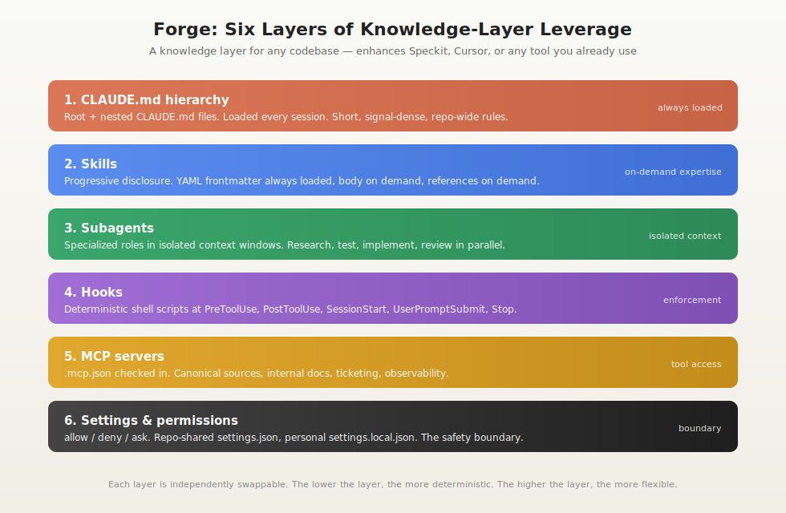
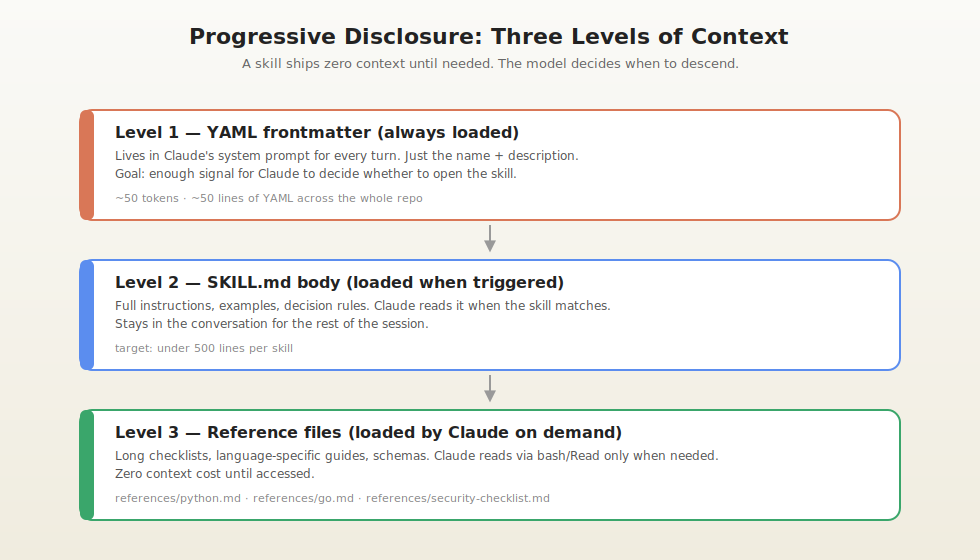
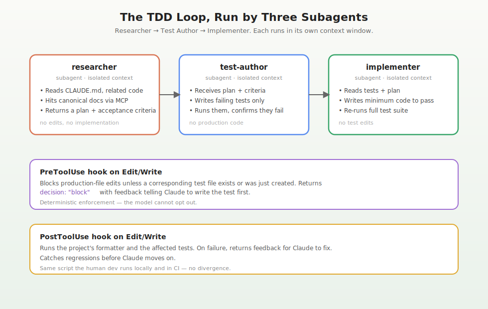
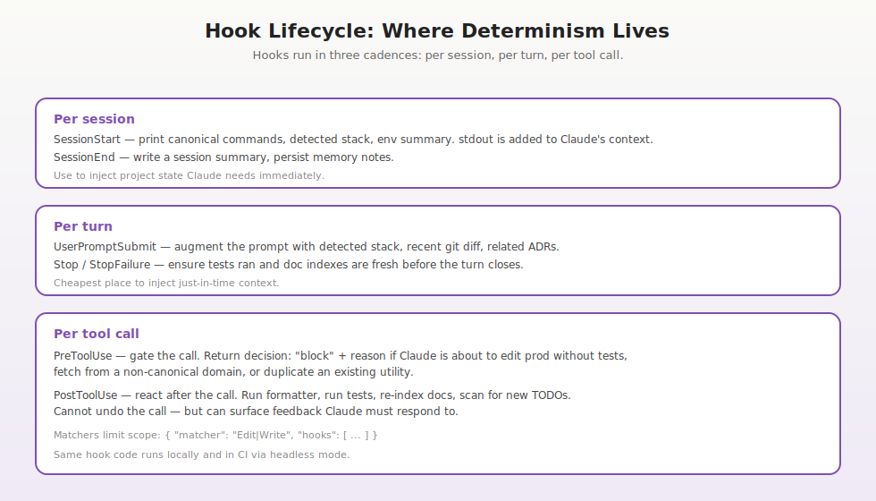
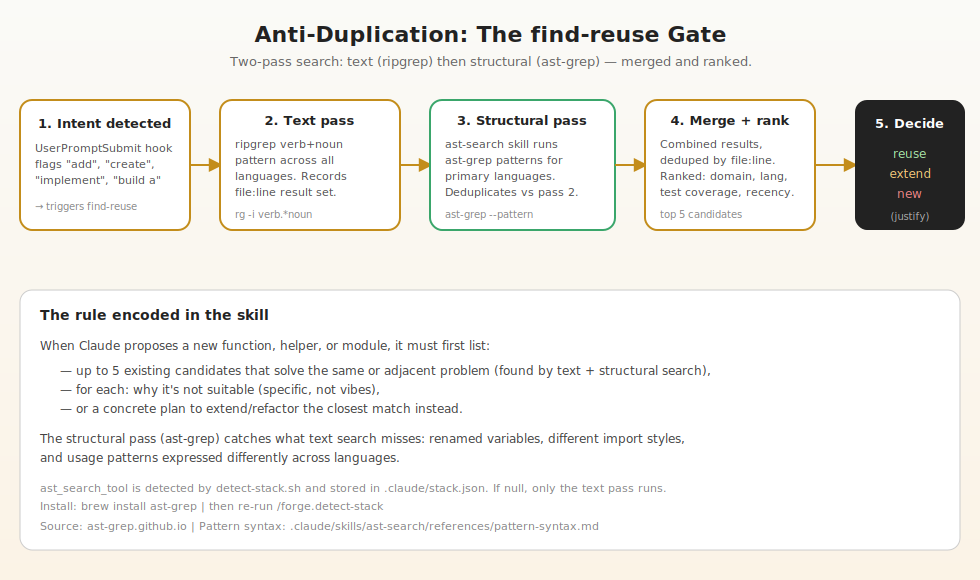
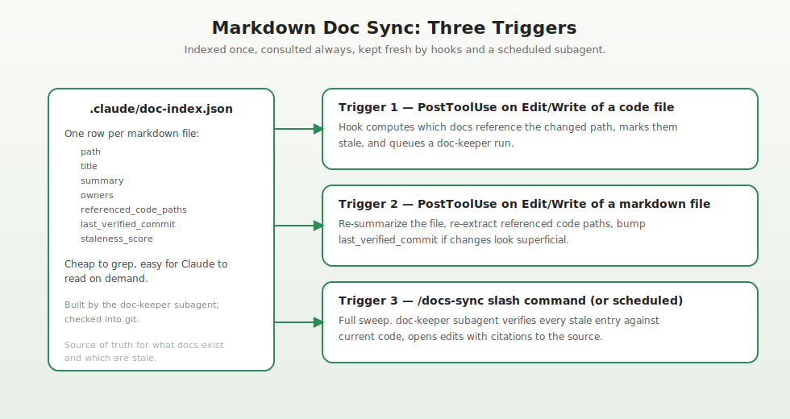
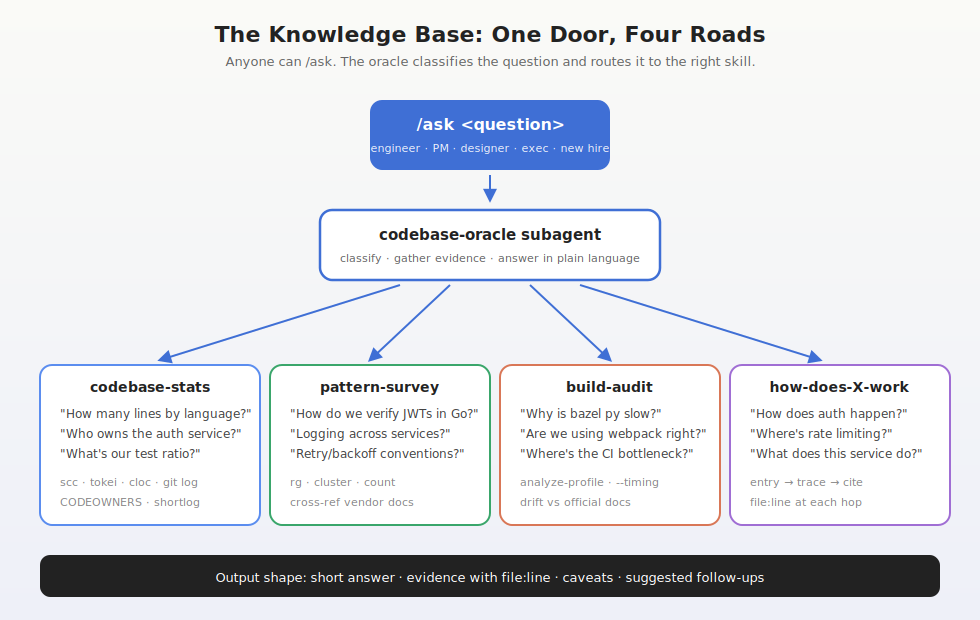

# Building a Claude Harness for a Million-Line Multi-Language Monorepo

> A field guide to the configuration, conventions, and guardrails that make Claude reliable inside a real codebase — not a toy. Every claim cites a primary Anthropic source. A working cookiecutter is in the sibling folder.

---

## The problem

A million-line monorepo is not just "a lot of files." It is:

- **Many languages**, each with its own idioms, build system, test runner, and lint config.
- **Many ways to do the same thing**, accreted over years, only some of which are blessed.
- **A documentation surface** that mostly lies about the code by the second quarter of any year.
- **A test suite** that is slow, partially flaky, and selectively obeyed.
- **A team** that mostly cannot hold the whole thing in their head, and increasingly works alongside an AI that definitely cannot.

If you point Claude at this without a harness, you get probable but unreliable output. With a harness, you get a tool that mostly one-shots — and when it doesn't, fails in ways you can see and correct. The harness is not a model upgrade. It's a configuration of context, tools, and enforcement layers that channels the model into the workflows you actually want.

Anthropic's own framing: context engineering is "the set of strategies for curating and maintaining the optimal set of tokens (information) during LLM inference, including all the other information that may land there outside of the prompts" ([Effective context engineering for AI agents](https://www.anthropic.com/engineering/effective-context-engineering-for-ai-agents)). The harness is the operational form of that idea.

---

## The mental model: six layers



Each layer trades flexibility for determinism. The top is what Claude reads first; the bottom is what enforces what Claude is allowed to do.

| Layer | What it is | When it loads | Purpose |
|---|---|---|---|
| 1. **CLAUDE.md hierarchy** | Markdown files at the repo root and key subdirectories | Every session; nested ones when files in that subtree are read | Persistent, repo-wide rules |
| 2. **Skills** | Folders with `SKILL.md` + reference files | Frontmatter always; body when triggered; references on demand | On-demand expertise without context bloat |
| 3. **Subagents** | Markdown files in `.claude/agents/` | Spawned by Claude when their description matches | Isolated context windows for specialized roles |
| 4. **Hooks** | Shell scripts wired in `settings.json` | At lifecycle events (session, turn, tool call) | Deterministic enforcement (where it pays off) |
| 5. **MCP servers** | External tool servers via `.mcp.json` | When Claude calls an MCP tool | Canonical-source access |
| 6. **Settings & permissions** | `settings.json` allow/deny/ask | Always | The safety boundary |

You compose these. Skip a layer and the system still works; you just lose a guarantee. The harness in the sibling folder ships all six.

---

## Layer 1: CLAUDE.md hierarchy

`CLAUDE.md` is the file Claude reads at the start of every session ([Give Claude context: CLAUDE.md and better prompts](https://support.claude.com/en/articles/14553240-give-claude-context-claude-md-and-better-prompts)). It is **not** documentation — it's persistent instructions. The team's mental model should be: "everything in here gets paid for on every request, so every line has to be worth it."

Three guidelines that come straight from Anthropic's best-practices post and their support docs:

1. **Hierarchical placement.** Put one at the repo root for org-wide rules. Put nested `CLAUDE.md` files in subdirectories whose conventions diverge — those are loaded only when Claude reads a file in that subtree ([Best practices for Claude Code](https://www.anthropic.com/engineering/claude-code-best-practices); [Memory](https://docs.anthropic.com/en/docs/claude-code/memory)).
2. **Short and signal-dense.** Aim for under roughly 200 lines. Every line is loaded on every request, so the cost compounds across the team ([Give Claude context: CLAUDE.md and better prompts](https://support.claude.com/en/articles/14553240-give-claude-context-claude-md-and-better-prompts)).
3. **Update it when Claude does something wrong.** Anthropic's published convention: anytime Claude does something incorrectly, add the rule to `CLAUDE.md` so it doesn't repeat the mistake ([Best practices for Claude Code](https://www.anthropic.com/engineering/claude-code-best-practices)).

What does **not** belong in `CLAUDE.md`:

- Long tables of conventions, language-specific style guides, security checklists. Those go in **skills** — loaded only when relevant.
- Setup instructions for humans. Those belong in a `README.md`.
- Project lore, history, or anything decorative.

The harness's root `CLAUDE.md` in this scaffold is ~60 lines. It states the five things that matter: always run `/detect-stack`, always run `find-reuse` before new code, TDD by default, canonical sources only, and treat the `=== project-constitution ===` block as top-level non-negotiables that override any conflicting instruction (or warn the user if no constitution is loaded).

### A note on `@file` imports

CLAUDE.md supports `@path` imports for organization. Imported content **still loads at session start** ([Memory](https://docs.anthropic.com/en/docs/claude-code/memory)) — it does not reduce context. Use it to keep the file readable for humans, not to "hide" expensive content. If you want on-demand loading, use a skill.

### The project constitution: CLAUDE.md's companion

`CLAUDE.md` is for org-wide rules that apply to every repo. The project constitution (`.forge/constitution.md`) is for project-specific identity — purpose, non-negotiables, architecture decisions, risk posture, team conventions, and out-of-scope items. It is authored interactively via `/forge.constitution`, which runs the `project-constitution` skill: the `researcher` subagent scans the repo for implicit principles, then walks you through each section one at a time.

Once created, the constitution is injected in two ways:
- **`session-start.sh`** wraps it in `=== project-constitution ===` / `=== end project-constitution ===` delimiters so Claude sees it at the top of every session.
- **`post-compact.sh`** (`PostCompact` hook) reinjects it as `additionalContext` after context compaction, so the non-negotiables survive context window resets.

Both paths enforce a 2000-character limit and warn if the file exceeds it. `CLAUDE.md` instructs Claude to treat the delimited block as top-level non-negotiables that override any conflicting instruction in the session.

---

## Layer 2: Skills

A skill is a folder with a `SKILL.md` inside. The file starts with YAML frontmatter, then markdown instructions. Three things happen, in this order ([Skill authoring best practices](https://docs.claude.com/en/docs/agents-and-tools/agent-skills/best-practices)):



**Level 1** — the YAML frontmatter (just `name` and `description`) is in Claude's system prompt every turn. This is how Claude knows the skill exists.

**Level 2** — when the description matches the current task, Claude opens `SKILL.md` and reads the body. It then stays in the conversation.

**Level 3** — `SKILL.md` can reference long files in `references/`. Those are read only when Claude actively decides to. Until then, zero context cost.

That's progressive disclosure. The keep-`SKILL.md`-under-500-lines guideline from the official authoring guide exists for this reason: the skill body is what's most often loaded; the bulky material belongs in `references/`.

### What I put in skills (and why each one earns its keep)

The scaffold ships ten, listed below. The pattern: a skill exists when there's a repeatable decision Claude must make that needs more than a sentence of rules.

- **`tdd-workflow`** — codifies the researcher → test-author → implementer sequence and routes work through subagents. References cover per-language test naming and BDD spec style.
- **`canonical-research`** — codifies the official-docs-first rule and the citation format (URL + verbatim quote) for every external claim.
- **`find-reuse`** — before writing any new helper, run a grep/AST sweep for existing implementations and return ranked candidates. Backed by a hook so Claude can't quietly skip it.
- **`repo-conventions`** — read 2-3 analogous files before creating a new one. Mirror their naming, error style, import order, and test placement.
- **`code-review`** — structured rubric for reviewing diffs (security, perf, conventions, coverage, docs).
- **`doc-sync`** — the rules the `doc-keeper` subagent follows when updating markdown.
- **`task-decomposition`** — converts a feature spec into a dependency-ordered task list with routing metadata. Each task is ≤ 200 lines of change and has explicit acceptance criteria.
- **`clarify-spec`** — scans a task list for underspecification, contradictions, and implicit dependencies. Returns structured questions (not answers) for the user to resolve interactively.
- **`implement-plan`** — validates the task graph (DAG, no missing dependencies, all routing fields resolved) and produces a per-task routing decision before any code is written.
- **`project-constitution`** — interactive, LLM-assisted authoring of `.forge/constitution.md`. Scans the repo for signals, drafts all six required sections (Purpose, Non-negotiables, Architectural principles, Risk posture, Team conventions, Out of scope), and walks the user through accepting, editing, or skipping each before writing.

Notice what's not a skill: things that should always apply (those are in `CLAUDE.md`), things that need their own context window (those are subagents), and things that need deterministic enforcement (those are hooks).

---

## Layer 3: Subagents

A subagent is a markdown file in `.claude/agents/` (project-scoped) or `~/.claude/agents/` (user-scoped) with YAML frontmatter declaring its `name`, `description`, and allowed `tools`, then a system prompt ([Create custom subagents](https://docs.claude.com/en/docs/claude-code/sub-agents)). Two facts about subagents that drive the design:

1. **Each subagent runs in its own context window.** Their research and tool calls don't pollute the main session ([Create custom subagents](https://docs.claude.com/en/docs/claude-code/sub-agents)). For million-line codebases this is the single most important leverage.
2. **Claude triggers them based on the `description` field.** Anthropic explicitly recommends phrases like "use PROACTIVELY" and "MUST BE USED" to make them auto-trigger ([Best practices for Claude Code](https://www.anthropic.com/engineering/claude-code-best-practices); [Subagents](https://docs.claude.com/en/docs/claude-code/sub-agents)).

### The six subagents in the scaffold

Each one has one job. None of them tries to do another's job.

| Subagent | Job | Allowed tools |
|---|---|---|
| `researcher` | Read code + canonical sources, output a plan. **No edits.** | Read, Grep, Glob, Bash, WebFetch |
| `test-author` | Write failing tests against the plan. **No production code.** | Read, Edit, Write, Bash, Grep, Glob |
| `implementer` | Minimum code to turn tests green. **No test edits.** | Read, Edit, Write, Bash, Grep, Glob |
| `code-reviewer` | Structured review of the diff. **No edits.** | Read, Bash, Grep, Glob |
| `doc-keeper` | Sync markdown to current code. **No code edits.** | Read, Edit, Write, Bash, Grep, Glob |
| `build-detective` | Detect stack, write `.claude/stack.json`. | Read, Bash, Grep, Glob |

The hard constraints (no edits / no code / no tests) are in the system prompt of each agent so the subagent will refuse if asked.

### Why this beats one big agent

Three reasons:

1. **Context isolation.** The researcher might read 30 files. The implementer doesn't need any of that — it just needs the plan. Anthropic's guidance: "When Claude researches a codebase it reads lots of files that consume context; subagents run in separate context windows and report back summaries without cluttering your main conversation" (paraphrase from [Effective context engineering for AI agents](https://www.anthropic.com/engineering/effective-context-engineering-for-ai-agents)).
2. **Tool scoping.** The researcher can never accidentally edit a file because Edit isn't in its tool list. The code-reviewer can never accidentally fix what it's reviewing. These are not norms — they're enforced by the platform.
3. **Parallelism.** You can run a researcher on a feature and a code-reviewer on a different branch simultaneously. Anthropic documents using `git worktree` to give each parallel agent its own checkout ([Best practices for Claude Code](https://www.anthropic.com/engineering/claude-code-best-practices)).

### The TDD loop in practice



`/tdd <task>` runs all three in sequence, pausing for human approval between stages. The plan is reviewed before tests are written. The tests are reviewed before implementation. The implementation is reviewed by `code-reviewer` before the change is reported done.

This mirrors what Anthropic's Security Engineering team described: their workflow went from "design doc → janky code → refactor → give up on tests" to "ask Claude for pseudocode, guide it through test-driven development, check in periodically" ([How Anthropic teams use Claude Code](https://www.anthropic.com/news/how-anthropic-teams-use-claude-code)).

---

## Layer 4: Hooks — where the "must" lives

Skills and subagents are how you make the right thing easy. Hooks are how you make the wrong thing impossible.

A hook is a shell command, HTTP endpoint, or prompt that fires at a lifecycle event ([Hooks reference](https://docs.claude.com/en/docs/claude-code/hooks)). Events fall into three cadences:



- **Per session** — `SessionStart`, `SessionEnd`. Print repo facts the model needs immediately.
- **Per turn** — `UserPromptSubmit`, `Stop`. Cheapest place to inject just-in-time context.
- **Per tool call** — `PreToolUse`, `PostToolUse`. Gate or react to specific actions.

`PreToolUse` is the powerful one. It can return JSON containing `decision: "block"` and a `reason` string, and Claude has to take that feedback into account ([Hooks reference](https://docs.claude.com/en/docs/claude-code/hooks)). That's the enforcement primitive.

### The six hooks in the scaffold

1. **`session-start.sh`** — prints repo HEAD, branch, detected stack, uncommitted file count, and doc-staleness count. Also injects `.forge/constitution.md` between `=== project-constitution ===` and `=== end project-constitution ===` delimiters if the file exists and is under 2000 characters. stdout is added to Claude's context ([Hooks reference](https://docs.claude.com/en/docs/claude-code/hooks)).
2. **`post-compact.sh`** — `PostCompact` hook. Reinjects `.forge/constitution.md` as `additionalContext` after context compaction, using the same 2000-character guard. Ensures the project constitution survives context window resets without manual intervention.
3. **`prompt-augment.sh`** — `UserPromptSubmit` hook. Scans for intent verbs ("add", "implement", "create") and appends a reminder to run `find-reuse` first.
4. **`pre-edit-guard.sh`** — `PreToolUse` on `Edit`/`Write`. Enforces TDD **only in packages that already have tests**. If the package directory contains zero test files, the hook logs a warning to stderr and lets the edit through — backfilling coverage is a separate decision, not something this hook should force on legacy code. In tested packages it returns `decision: "block"` with a message routing Claude to `test-author` first.
5. **`post-edit-format.sh`** — `PostToolUse` on `Edit`/`Write`. Runs the formatter declared in `stack.json`. Same script humans run locally and CI runs.
6. **`post-edit-doc-mark.sh`** — `PostToolUse` on `Edit`/`Write`. Bumps `staleness_score` in `doc-index.json` for any markdown that references the edited path.

The hooks all live in `.claude/hooks/`, all start with `#!/usr/bin/env bash`, all read tool input JSON from stdin, and emit either nothing (exit 0 → proceed) or a small JSON object on stdout. That's the entire contract.

### Why deterministic enforcement matters

You can ask Claude to follow rules. You can repeat the rules in `CLAUDE.md`. Even with a careful prompt, the model occasionally won't. With a hook, it cannot — the platform refuses the tool call. That's the difference between "we have a convention" and "we have a guarantee," and at the scale of a million-line monorepo with many contributors, only the second one holds up.

---

## Layer 5: MCP — the canonical-source backbone

MCP (Model Context Protocol) lets Claude call out to external tool servers ([Connect Claude Code to tools via MCP](https://docs.claude.com/en/docs/claude-code/mcp)). Configuration lives in a checked-in `.mcp.json` at the repo root, so every developer on the team gets the same servers ([Best practices for Claude Code](https://www.anthropic.com/engineering/claude-code-best-practices)).

For a large multi-language codebase, MCP earns its keep when the canonical sources you want Claude to consult are not the open web:

- Your internal API portal (run an HTTP MCP server in front of it).
- Your ADR repository.
- Your observability platform (Datadog, Sentry, etc.) so Claude can reason about live behavior, not just code.
- Your ticket tracker (Linear, Jira) so plans link to acceptance criteria.

Configuration is straightforward:

```json
{
  "mcpServers": {
    "internal-docs": {
      "type": "http",
      "url": "https://docs.internal.example.com/mcp",
      "timeout": 30000
    }
  }
}
```

The `timeout` field is per-server, in milliseconds ([MCP](https://docs.claude.com/en/docs/claude-code/mcp)). Use `--mcp-debug` to troubleshoot.

### Canonical-source guidance, not enforcement

Earlier drafts of this harness included a `canonical-source-guard.sh` hook that blocked `WebFetch` to any domain not on an allowlist. That was too brittle in practice — every new framework requires a config edit, and an over-aggressive denylist can block legitimate research. The current design uses **model-enforced guidance** instead:

- `CLAUDE.md` carries one rule, repeated in plain language: "When you need external information about a framework, library, language, or protocol, the vendor's official documentation is the first and primary source. Community blogs, Stack Overflow, Medium, etc. are fallbacks, never leads."
- The `canonical-research` skill spells out the procedure: official docs first, repo second, community sources as a labeled last resort. Cite every external claim with a URL + one-sentence verbatim quote so the human reviewer can verify in one click.
- If the official docs don't cover a question, Claude is instructed to say so — not to silently fall back.

This is softer than a hook but covers more ground. For a FastAPI routing question, Claude reaches for `fastapi.tiangolo.com`. For a `kubectl` flag, `kubernetes.io/docs`. The model gets the rule on every turn and the reviewer sees the citations — both layers catch drift before it becomes a problem.

---

## Layer 6: Settings and permissions

`.claude/settings.json` is checked into the repo. Personal overrides go in `.claude/settings.local.json`, which is gitignored.

Permission rules use the format `Tool` or `Tool(specifier)`. Rules evaluate in order: deny → ask → allow ([Claude Code settings](https://docs.anthropic.com/en/docs/claude-code/settings)). First match wins.

The scaffold's permissions:

```json
{
  "permissions": {
    "allow": [
      "Read(./**)", "Edit(./**)", "Write(./**)",
      "Bash(git status)", "Bash(git diff:*)", "Bash(git log:*)",
      "Bash(npm run test:*)", "Bash(pytest:*)", "Bash(go test:*)"
    ],
    "deny": [
      "Bash(curl *)", "Bash(wget *)",
      "Bash(git push:*)", "Bash(git reset --hard *)",
      "Read(./.env)", "Read(./.env.*)", "Read(./secrets/**)"
    ],
    "ask": [
      "Bash(git commit:*)", "Bash(git checkout:*)"
    ]
  }
}
```

Three observations:

1. `curl` and `wget` are denied because they're the obvious bypass for the canonical-source guard. If Claude can't `WebFetch`, it should not be able to shell out either.
2. `git push`, `git reset --hard`, and `npm publish` are denied outright — irreversible.
3. `git commit` and `git checkout` are in `ask` — Claude can request but the human gates.

The `Bash(rm -rf *)` deny is a literal wildcard match, not a shell glob. It's a coarse safeguard; the real protection is the user not approving any `Bash(rm:*)` allow in their own `settings.local.json`.

---

## Auto-detecting the build and test toolchain

A million-line monorepo probably has a Makefile, a Bazel BUILD, a couple of package.jsons, a pyproject.toml, a Cargo.toml, a Gemfile, and a build.gradle. The harness should pick the right one without asking.

The scaffold's `scripts/detect-stack.sh` is conservative — it inspects what's actually checked in and produces `.claude/stack.json` with the exact commands a human would type. The precedence rule is: **if a `Makefile` declares `test:`, that wins over package.json's `"test"` script.** The Makefile is the team's canonical entrypoint.

```json
{
  "languages": ["go", "python", "typescript"],
  "test":   { "command": "make test",  "commands": ["make test"] },
  "lint":   { "command": "make lint",  "commands": ["make lint"] },
  "build":  {                          "commands": ["make build"] },
  "format": {                          "commands": ["make format"] },
  "detected_at_commit": "abc1234"
}
```

`session-start.sh` reads this and surfaces it on every session. `post-edit-format.sh` dispatches to the right formatter by file extension. The `/detect-stack` slash command re-runs detection on demand. If the detective finds two incompatible build systems, it lists both and surfaces the conflict — it does not silently pick one.

---

## Avoiding the duplicate-code spiral

The hardest tech debt to detect in a million-line repo is the second implementation of something that already exists. Claude makes it worse by default — it has no view of the whole codebase, so it reaches for a fresh `parseUrl` or `retryWithBackoff` rather than searching for prior art.

The harness fixes this with three coupled pieces:



1. **`prompt-augment.sh`** detects intent verbs in the user's message and appends a reminder.
2. **`find-reuse` skill** defines the search procedure: extract the verb-noun pair, ripgrep across the repo, rank candidates by domain proximity, language match, test coverage, and recency. Return the top five with `file:line`, signature, and a recommendation: **reuse / extend / new**.
3. **`implementer` subagent** is instructed to refuse to introduce a new helper unless `find-reuse` returned zero suitable candidates **or** each candidate has a specific documented reason (different invariants, deprecated, layered dependency violation) — vague reasons don't count.

The result is not zero new code. It's that new code only appears when the existing patterns genuinely don't fit, and Claude has to say why before the implementer will write it.

`references/reuse-anti-patterns.md` in the skill enumerates the worst patterns to watch for: parallel parsers, drifted validators, snowflake retry loops, format-by-string-concat, one-off date parsers. These are the things that show up in every large codebase and cost the most to consolidate later.

---

## Keeping markdown documentation in sync

Most repository documentation rots because no human is paid to keep it fresh. Claude can be — if the harness gives it the right signal.



The scaffold uses a single source of truth: `.claude/doc-index.json`. One entry per checked-in markdown file:

```json
{
  "path": "docs/auth/oauth.md",
  "title": "OAuth flows",
  "summary": "OAuth 2.1 flows used by the API gateway.",
  "owners": ["@auth-team"],
  "referenced_code_paths": [
    "services/gateway/auth/oauth.go",
    "services/gateway/auth/jwt.go"
  ],
  "last_verified_commit": "abc1234",
  "staleness_score": 0
}
```

Three triggers keep it fresh:

1. **`post-edit-doc-mark.sh`** runs after any `Edit`/`Write`. If the changed path appears in any doc's `referenced_code_paths`, the doc's `staleness_score` is incremented. No Claude in the loop.
2. **The `doc-keeper` subagent** is auto-triggered (per its description) when the change set overlaps stale entries. It re-reads the referenced code, identifies divergence, updates the markdown, and resets `staleness_score`.
3. **`/docs-sync`** runs a full sweep on demand or on a cron.

Two hard rules in the `doc-sync` skill:

- The doc-keeper **never invents** documentation. If code is user-facing and no doc covers it, it surfaces the gap to the user — it does not auto-generate prose.
- Every factual claim in the updated doc must trace to a checked-in file. The doc-keeper cites `file:line` in the PR commentary.

This is the only sustainable shape: docs and code are linked by a checked-in index, edits to code surface staleness automatically, and a tightly scoped agent does the updates.

---

## The slash commands

Nine commands tie the workflows together. Each is just a markdown file in `.claude/commands/` ([Slash commands](https://docs.claude.com/en/docs/claude-code/slash-commands)). Anthropic merged the older `.claude/commands/` system into skills — both still work, and the scaffold uses slash commands for high-leverage workflows that should appear in the `/` menu, and skills for the lower-level rules.

| Command | What it does |
|---|---|
| `/detect-stack` | Runs `build-detective`, writes `.claude/stack.json`, prints summary. |
| `/plan <task>` | Researcher subagent produces a written plan. No code. |
| `/tdd <task>` | Researcher → test-author → implementer → code-reviewer, runs as a single pipeline. |
| `/review` | Code-reviewer subagent against `git diff HEAD`. |
| `/docs-sync` | Doc-keeper subagent runs a full markdown refresh. |
| `/find-reuse <task>` | Returns up to 5 ranked prior-art candidates. |
| `/tasks <spec>` | Decomposes a feature spec into a numbered, dependency-ordered task list in `.forge/NNN-slug/tasks.md`. |
| `/clarify [NNN]` | Surfaces spec ambiguities, collects all answers, and writes resolved answers to `.forge/NNN-slug/clarifications.md`. |
| `/implement [NNN]` | Validates the task graph, produces a routing plan, executes tasks in an isolated git worktree, and presents an end-of-run AskUserQuestion menu. |
| `/constitution` | Interactive authoring of `.forge/constitution.md` — create, update a section, or regenerate from scratch. |

The first six are single-purpose utilities. The last four form a pipeline: `/constitution` (one-time setup) → `/tasks` → `/clarify` → `/implement`. Each does one thing; the pipeline is what the composition produces.

---

## Headless mode and CI

The same harness runs in CI. Claude Code's `-p` (or `--print`) flag puts it in non-interactive mode and reads stdin ([Run Claude Code programmatically](https://docs.claude.com/en/docs/claude-code/headless)). For CI you want `--bare` so the run doesn't pick up local settings ([same source](https://docs.claude.com/en/docs/claude-code/headless)).

Useful patterns:

```bash
# Pre-commit: review the staged diff and exit nonzero on issues
git diff --staged | claude -p --bare \
  "Review this diff using the code-review skill. Exit 1 if you would request changes."

# Nightly doc sync
claude -p --bare "Run /docs-sync. Open a PR with any updates."

# Cost-aware
claude -p --output-format json --bare "Summarize today's open PRs." | jq '.total_cost_usd'
```

With `--output-format json`, the response includes `total_cost_usd` and per-model breakdown for scripted spend tracking ([Headless mode](https://docs.claude.com/en/docs/claude-code/headless)).

Headless mode does not persist between invocations — each run is a fresh session that picks up `CLAUDE.md`, hooks, skills, and subagents from disk. That makes the harness automatically the same in interactive and CI use.

---

## Parallelism for large changes

For a sweeping refactor, run multiple Claudes in parallel — one per worktree.

```bash
git worktree add ../repo-feature-a feature-a
cd ../repo-feature-a && claude
```

Each session sees the same `.claude/` config but works in its own checkout, so edits don't collide ([Best practices for Claude Code](https://www.anthropic.com/engineering/claude-code-best-practices); [Building a C compiler with a team of parallel Claudes](https://www.anthropic.com/engineering/building-c-compiler)).

Common pattern at scale: one Claude on the feature, one on documentation, one on test coverage, one on code review. They never see each other's context; they only see merged commits.

---

## Packaging the harness as a plugin

The whole scaffold is also a Claude Code plugin. Plugins are "custom collections of slash commands, agents, MCP servers, and hooks that install with a single command" ([Customize Claude Code with plugins](https://www.anthropic.com/news/claude-code-plugins)). The plugin layout is:

```
.claude-plugin/plugin.json    required manifest
commands/                     slash commands
agents/                       subagents
skills/                       skills
hooks/                        hooks
.mcp.json                     MCP servers
```

To distribute internally, publish the marketplace as a git repo with a `.claude-plugin/marketplace.json` ([Create and distribute a plugin marketplace](https://docs.claude.com/en/docs/claude-code/plugin-marketplaces)) listing the plugins. Engineers install with:

```
/plugin marketplace add your-org/marketplace-repo
/plugin install forge
```

This is the right shape for "cookie cutter that any team can adopt": one command installs the latest version of every convention, and you keep `CLAUDE.md` per-repo for the project-specific bits.

---

## What the model sees on a real ask

A walkthrough of `claude "fix the bug where /users/:id returns 500 when id is non-numeric"` in a repo with the harness installed:

1. **SessionStart hook** prints repo HEAD, branch, detected stack, dirty file count, stale-doc count, and injects `.forge/constitution.md` (if present) between `=== project-constitution ===` delimiters. Claude knows it's looking at a Go service with `make test` and sees the project's non-negotiables immediately.
2. **CLAUDE.md** is read: TDD by default, find-reuse first, canonical sources only.
3. **UserPromptSubmit hook** sees no creation intent verbs, so it doesn't inject the find-reuse reminder.
4. The model spawns `researcher`. The researcher greps for `/users/:id`, reads the handler and its tests, hits `pkg.go.dev` (allowlisted) for the relevant routing library behavior. Returns: "input is parsed via `strconv.Atoi` without error handling; tests cover only the success path; suggested acceptance criteria: return 400 with structured error when id is non-numeric, log a warn, do not call DB."
5. Human approves the plan.
6. `test-author` writes a single Go table test with the failing case. Confirms it fails. Commits the test.
7. **PreToolUse hook** on `Edit` against the handler file: a test exists, edit proceeds.
8. `implementer` adds the parse-and-respond-with-400 branch. Runs the package's tests. Green.
9. **PostToolUse hooks** run `gofmt` and bump `staleness_score` for any doc referencing the handler.
10. `code-reviewer` runs against `git diff HEAD`. Returns: convention check passes, coverage one new test, security clean, performance neutral, no doc gaps. Verdict: approve.
11. The doc-keeper runs because `staleness_score` was bumped — finds the docs/api/users.md file lists status codes; updates it to include 400, cites the new handler lines.
12. The final response cites every file:line touched and the canonical source quote used.

That's a one-shot. The reason it's a one-shot is that none of those steps depended on the human prompting carefully — they depended on the harness.

---

---

## Layer 7: The knowledge base — `/ask` for everyone

A million-line repo holds an enormous amount of operational knowledge. Most of it is locked inside the heads of the engineers who wrote it. The harness ships a knowledge-base layer so that anyone — engineer, PM, designer, exec, new hire on day one — can ask the codebase a question and get a correct, cited answer.



### One entry point

`/ask <question>` routes to the `codebase-oracle` subagent. That's it. No special syntax, no learning curve. The oracle classifies the question into one of five kinds and routes to the right skill.

| Question kind | Example | Skill |
|---|---|---|
| **Stat** | "How many lines by language?" "Who owns the auth service?" | `codebase-stats` |
| **Pattern survey** | "How do we verify JWTs in Go? What patterns and frameworks?" | `pattern-survey` |
| **How-does-X-work** | "How does a request get authenticated end-to-end?" | (oracle traces inline) |
| **Diagnostic** | "Why are bazel python builds slow? What's not matching official docs?" | `build-audit` |
| **Business / non-technical** | "What products does this repo cover?" "Who built billing?" | (README + CODEOWNERS + git log) |

The oracle is read-only — Edit and Write are not in its tool list. It cannot accidentally change anything it's explaining.

### Answer shape

Every answer follows the same structure so non-technical readers know what to expect:

1. **Short answer** — one or two sentences a non-technical reader can act on.
2. **What I found** — bullets with `file:line` citations.
3. **Caveats** — what wasn't checked, what might be stale.
4. **Suggested follow-ups** — two or three concrete next questions.

The agent system prompt is explicit: numbers get exact values (never approximations), guesses are labeled as guesses, hedging filler is banned. The full prompt is in `.claude/agents/codebase-oracle.md`.

### How `codebase-stats` answers a count question

> **Q:** How many lines of code do we have by language?

The skill runs `scc --no-cocomo` (falling back to `tokei` or `cloc`), notes the current commit SHA, and reports exact counts per language with test-vs-production breakdown. If no counting tool is installed, the oracle says so and offers a `wc -l` fallback with a caveat about accuracy. No hand-counting. No estimates dressed up as facts.

### How `pattern-survey` answers a "how do we do X" question

> **Q:** What frameworks are we using for AuthN/Z and what are the common patterns for verifying JWTs and checking RBAC permissions in Go?

The skill ripgreps for the relevant terms, reads each hit, clusters implementations by approach (library + flags + flow), counts call sites per cluster, identifies the newest and oldest, **cross-references each cluster against the official documentation of the library it uses**, and produces a cluster map with a convergence recommendation. Each cluster has a citation; each recommendation says what to converge on and why.

The pattern-survey skill is also where Claude's "official docs first" rule earns its keep. If a cluster skips a check the library's docs say is required (say, JWT `iss` validation), the survey flags it explicitly with the doc quote.

### How `build-audit` answers a diagnostic question

> **Q:** Bazel python builds take forever. What parts seem slowest, and where are we doing things that don't match the official Bazel docs?

The skill runs the tool's own introspection — `bazel analyze-profile`, `bazel query`, BUILD file inspection — collects data points (not vibes), then ranks hypotheses by confidence × impact. For each hypothesis it cites:
- The data point from your profile that supports it.
- The relevant passage from the **official Bazel docs** that recommends a different configuration, if there is one.
- The smallest experiment that would confirm or rule out the hypothesis.

This is the "are we using X correctly?" pattern, generalized. Most diagnostic questions reduce to: collect signals, find drift against the canonical guidance, rank by impact, recommend the cheapest verifying test.

### Why anyone can use it

Three properties make the knowledge base usable beyond engineering:

- **Plain-language default.** Jargon only when the user used it first.
- **Always cited.** Every claim has a `file:line` or doc URL. A non-technical reader can ignore the citations; a technical reader can click through.
- **Read-only.** The oracle cannot edit anything. There is no risk in asking.

The slash commands `/stats`, `/survey <topic>`, and `/audit <symptom>` are shortcuts that pre-route to the right skill. `/ask <anything>` is the catch-all.

---

## Installing, updating, and uninstalling the harness

A scaffold is only useful if it's easy to roll out, easy to upgrade as it evolves, and easy to back out of if something doesn't fit. The scaffold ships an interactive installer at `scripts/forge.sh` that handles all three.

### Install

```bash
./scripts/forge.sh                          # interactive menu
./scripts/forge.sh install /path/to/repo    # direct
./scripts/forge.sh --yes install /path/to/repo   # non-interactive (CI)
```

What it does:
- Refuses to overwrite an existing install (offers to `update` instead).
- Shows you exactly what will be copied before doing anything.
- Copies the managed paths: `.claude/agents/`, `.claude/skills/`, `.claude/commands/`, `.claude/hooks/`, `.claude/settings.json`, `.claude-plugin/plugin.json`, `.mcp.json`, and the two scripts.
- Creates `CLAUDE.md` from the template **only if it doesn't already exist** — your existing `CLAUDE.md` is never touched.
- Runs `detect-stack.sh` to populate `.claude/stack.json`.
- Writes `.Forge-manifest.json` recording the version, source, and timestamp.

### Update

```bash
./scripts/forge.sh update /path/to/repo
./scripts/forge.sh --yes update /path/to/repo
```

What it does:
- Snapshots every managed file to `.Forge-backups/<timestamp>/` **before** making any changes.
- Shows a diff summary of which managed paths will change.
- Rsyncs new versions with `--delete` so files removed in the new release are removed in the target.
- **Never touches** `CLAUDE.md`, `.claude/doc-index.json`, or `.claude/stack.json` — those are yours.
- If `.mcp.json` has local edits, writes the new version as `.mcp.json.new` and warns you to merge.
- Updates the manifest.

You can always roll back: `./scripts/forge.sh restore /path/to/repo <backup-dir>`.

### Uninstall

```bash
./scripts/forge.sh uninstall /path/to/repo
./scripts/forge.sh --yes uninstall /path/to/repo
```

What it does:
- Takes one final backup.
- Removes only the managed paths.
- Preserves `CLAUDE.md`, the doc index, the stack file, and the backups directory.
- Removes the manifest.

### Status

```bash
./scripts/forge.sh status /path/to/repo
```

Prints the manifest and lists every managed path with a present/missing indicator. Useful for verifying an install or for CI checks.

### The flow for releasing updates to your team

1. Maintain the scaffold in its own git repo (e.g., `your-org/Forge`). The current release is v0.2.0.
2. Tag releases with semver. Bump `VERSION="..."` in `scripts/forge.sh` to match.
3. Engineers in target repos pull the new scaffold and run `forge.sh update <their-repo>`.
4. Backup snapshots make every update reversible.

For org-wide distribution as a Claude Code **plugin** (one command to install, lives in a marketplace) see [Create and distribute a plugin marketplace](https://docs.claude.com/en/docs/claude-code/plugin-marketplaces).

## Anti-patterns to avoid

- **A 1,000-line `CLAUDE.md`.** It bloats every request. Move depth into skills. If you can't justify a line as worth paying for on every turn, delete it.
- **One mega-agent with all the tools.** You lose context isolation, you lose tool scoping, and you lose the ability to forbid one role from doing another's job.
- **Hooks that print verbose output unconditionally.** Hook stdout becomes Claude's context. Keep it under 200 tokens unless you have a reason.
- **Allowing `Bash(*)` in permissions.** That's the same as no permissions. Whitelist the commands you actually need.
- **Letting Claude write its own `CLAUDE.md` updates without review.** It will helpfully add rules that subtly contradict your existing ones. Treat `CLAUDE.md` like a config file under code review.
- **Treating MCP as the answer to every integration.** If a CLI tool already exists and is in `allow`, that's faster than an MCP server. MCP earns its keep when the tool needs auth, state, or structured responses.
- **A doc-keeper that auto-generates new docs.** It will produce plausible nonsense. Constrain it to updates only; surface gaps to humans.

---

## Maintenance over time

The harness is itself code. Treat it that way:

- `.claude/` is checked into git. Changes get reviewed.
- Hook scripts have tests where they have logic worth testing. The `pre-edit-guard.sh` has a clear input/output contract — write a small test harness for it.
- The canonical-sources allowlist needs occasional maintenance. Add new vendor docs domains when you adopt new tech. Remove ones you've stopped using.
- `CLAUDE.md` is a living document. The team should resist the urge to grow it unboundedly; periodically prune.
- The skills, subagents, and hooks should be versioned together. Tag releases of the harness so a repo can pin to a known-good revision.
- Run a quarterly review: what did Claude get wrong? For each, decide — `CLAUDE.md` line, new skill, new subagent, new hook? Most of the time the answer is "we already have a skill, the description wasn't specific enough." Tighten and continue.

---

## Closing

The harness is not a model upgrade. It's the operational form of context engineering: a configured environment in which the model has the right rules, the right tools, the right enforcement, and the right escape hatches. With these six layers in place — `CLAUDE.md`, skills, subagents, hooks, MCP, settings — Claude moves from "useful but unpredictable" to "reliable on the bulk of asks, transparent when it isn't."

The cookiecutter in the sibling folder is opinionated. Use it as a starting point, not a doctrine. Edit the things that don't fit. The good news: every layer is independently swappable, and every file is short enough to be read and rewritten by a single engineer in an afternoon.

---

## Sources

All claims above are anchored to first-party Anthropic documentation. Each citation is linked inline; the consolidated list:

- [Best practices for Claude Code](https://www.anthropic.com/engineering/claude-code-best-practices)
- [How Anthropic teams use Claude Code](https://www.anthropic.com/news/how-anthropic-teams-use-claude-code)
- [Effective context engineering for AI agents](https://www.anthropic.com/engineering/effective-context-engineering-for-ai-agents)
- [Give Claude context: CLAUDE.md and better prompts](https://support.claude.com/en/articles/14553240-give-claude-context-claude-md-and-better-prompts)
- [Memory — How Claude remembers your project](https://docs.anthropic.com/en/docs/claude-code/memory)
- [Create custom subagents](https://docs.claude.com/en/docs/claude-code/sub-agents)
- [Extend Claude with skills](https://docs.claude.com/en/docs/claude-code/skills)
- [Skill authoring best practices](https://docs.claude.com/en/docs/agents-and-tools/agent-skills/best-practices)
- [Hooks reference](https://docs.claude.com/en/docs/claude-code/hooks)
- [Get started with Claude Code hooks](https://docs.claude.com/en/docs/claude-code/hooks-guide)
- [Connect Claude Code to tools via MCP](https://docs.claude.com/en/docs/claude-code/mcp)
- [Slash commands](https://docs.claude.com/en/docs/claude-code/slash-commands)
- [Claude Code settings](https://docs.anthropic.com/en/docs/claude-code/settings)
- [Run Claude Code programmatically (headless mode)](https://docs.claude.com/en/docs/claude-code/headless)
- [Customize Claude Code with plugins](https://www.anthropic.com/news/claude-code-plugins)
- [Create and distribute a plugin marketplace](https://docs.claude.com/en/docs/claude-code/plugin-marketplaces)
- [Equipping agents for the real world with Agent Skills](https://www.anthropic.com/engineering/equipping-agents-for-the-real-world-with-agent-skills)
- [Building a C compiler with a team of parallel Claudes](https://www.anthropic.com/engineering/building-c-compiler)
- [Effective harnesses for long-running agents](https://www.anthropic.com/engineering/effective-harnesses-for-long-running-agents)
